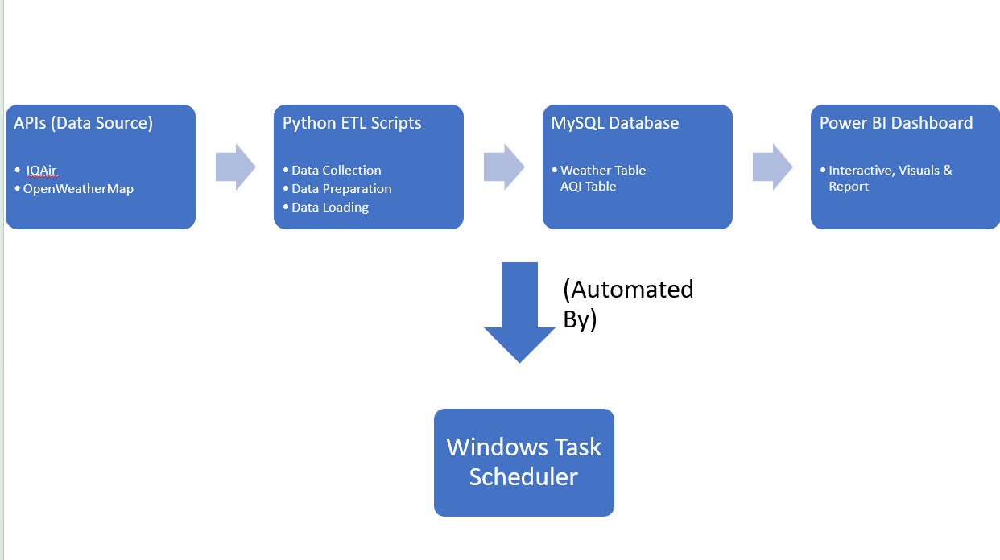
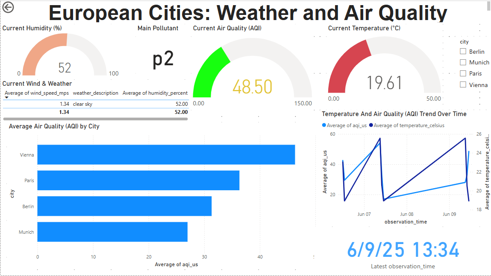

# European Cities: Weather and Air Quality Analysis

## 1. Project Overview & Business Case

This end-to-end ETL project collects, processes, and visualizes weather and air quality data for four major European cities: Munich, Berlin, Paris, and Vienna. The goal is to provide an interactive dashboard that allows users to analyze trends, compare urban environments, and investigate potential correlations between weather conditions (like temperature and humidity) and air pollution levels (like AQI and PM2.5). This provides valuable insights for public awareness, travel planning, and environmental monitoring.

***

## 2. Architecture

This project follows a classic ETL (Extract, Transform, Load) architecture to automatically collect data and make it available for analysis.

**Data Flow:**

1.  **Extract**: A Python script fetches raw data from two external sources:
    * **OpenWeatherMap API** for weather data.
    * **IQAir API** for air quality data.
2.  **Transform**: The raw JSON data is cleaned, structured, and transformed into clean, tabular data using the Pandas library in Python.
3.  **Load**: The transformed data is loaded into a **MySQL** relational database for persistent storage.
4.  **Orchestration**: The entire ETL pipeline is orchestrated by a master Python script (`main_pipeline.py`) and is scheduled for automatic daily execution using **Windows Task Scheduler**.
5.  **Visualization**: **Microsoft Power BI** connects directly to the MySQL database to create an interactive dashboard for data analysis and visualization.

***

## 3. Technologies Used

* **Data Collection**: Python (`requests` library), OpenWeatherMap API, IQAir API
* **Data Transformation**: Python (`pandas` library)
* **Data Storage**: MySQL Database
* **Automation/Orchestration**: Python, Windows Task Scheduler
* **Data Visualization**: Microsoft Power BI
* **Environment Management**: `venv` (Python Virtual Environment)
* **Version Control**: Git & GitHub

***

## 4. Setup and Installation

To run this project locally, please follow these steps:

1.  **Prerequisites**:
    * Python 3.x installed
    * MySQL Server installed
    * Power BI Desktop installed

2.  **Clone the Repository**:
    ```bash
    git clone [https://github.com/Mayank-Dabas/european-air-weather-tracker.git](https://github.com/Mayank-Dabas/european-air-weather-tracker.git)
    cd european-air-weather-tracker
    ```

3.  **Create and Activate Virtual Environment**:
    ```bash
    # Create the virtual environment
    python -m venv venv
    # Activate it on Windows
    .\venv\Scripts\activate
    ```

4.  **Install Dependencies**:
    ```bash
    pip install -r requirements.txt
    ```

5.  **Database Setup**:
    * In MySQL, create a database named `european_air_weather_db`.
    * Run the SQL commands found in `database_schema.sql` (or provide the commands here) to create the necessary tables.

6.  **Environment Variables**:
    * Create a `.env` file in the root of the project folder.
    * Add your API keys and database credentials to the `.env` file in the following format:
        ```ini
        OPENWEATHER_API_KEY=your_openweathermap_key
        IQVA_API_KEY=your_iqair_key
        DB_HOST=127.0.0.1
        DB_USER=your_db_user
        DB_PASSWORD=your_db_password
        DB_NAME=european_air_weather_db
        ```

***

## 5. How to Run the Pipeline

To run the ETL pipeline manually, execute the main script from the terminal:

```bash
python main_pipeline.py